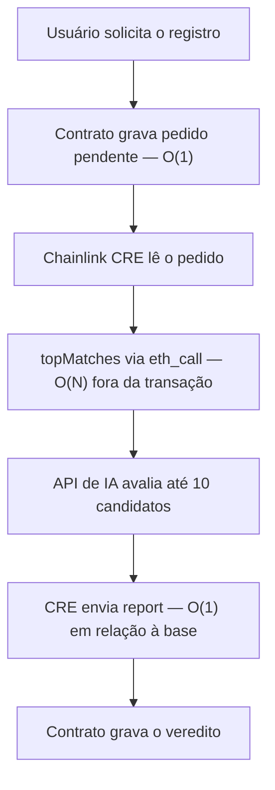

# MarcasChain — estabilização do gas on-chain em uma varredura O(n)

**Autor:** Armando Freire  
**Rede:** Ethereum Sepolia  
**Contrato atual:** [`0x424d3b3Ef97eC8670441866a380b7C01a63594fE`](https://sepolia.etherscan.io/address/0x424d3b3Ef97eC8670441866a380b7C01a63594fE)

## Resumo

Este documento descreve uma mudança de arquitetura aplicada a um smart contract que precisava comparar uma nova entrada com todos os registros existentes.

Na primeira versão, a comparação completa acontecia dentro da própria transação de registro. Como a quantidade de iterações dependia do tamanho da base, o gas crescia a cada novo registro. A função funcionava em uma base pequena, mas carregava um **unbounded loop**: não existia um limite fixo para o trabalho executado pela transação.

A solução não foi eliminar o cálculo nem reescrever todo o algoritmo. A solução foi mudar **onde** ele acontece:

- a transação do usuário apenas cria uma solicitação pendente;
- o Chainlink CRE executa a leitura pesada por `eth_call`;
- o contrato normaliza os nomes, percorre a base e devolve até dez candidatos;
- uma API de IA faz a avaliação semântica desses candidatos;
- somente um report pequeno retorna para atualizar o estado on-chain.

Com isso, o gas on-chain deixou de crescer com o número de marcas registradas. Em uma execução comparável na Sepolia, o fluxo completo caiu de **4.043.856 para 411.426 gas**, uma redução de **89,8%**.

---

## 1. O problema original

A primeira arquitetura realizava a análise antes de gravar o registro:

```solidity
function registrar(string memory nome) public {
    (uint256 score, string memory decision, , ) = analisar(nome);

    require(
        keccak256(bytes(decision)) != keccak256(bytes("REJECTED")),
        "Marca rejeitada"
    );

    // grava o registro
}
```

Internamente, `analisar()` precisava percorrer toda a lista de marcas:

```solidity
for (uint256 i = 0; i < listaMarcas.length; i++) {
    uint256 score = calcularScore(nome, listaMarcas[i]);
    // mantém o melhor resultado
}
```

Considerando `N` como o número de marcas, o trabalho da transação crescia, no mínimo, de forma linear em relação à base. O cálculo real também dependia do comprimento dos nomes, das normalizações, das comparações auxiliares e das alocações de memória.

O problema não era simplesmente “um loop em Solidity”. Loops com limites pequenos e conhecidos são normais. O problema era o limite depender de uma coleção que poderia crescer indefinidamente.

### Consequência

Cada marca adicionada aumentava o trabalho necessário para executar o próximo `registrar()`. Portanto:

```text
mais registros → mais iterações → mais gas → maior risco de bloqueio da função
```

Quando o consumo necessário ultrapassa o gas disponível para uma transação ou o limite aceito pelo bloco, aumentar o pagamento não resolve: a operação deixa de caber.

---

## 2. Por que declarar a função como `view` não resolvia

Uma função `view` não é automaticamente gratuita.

- Quando chamada externamente por `eth_call`, ela é executada localmente pelo nó e não gera uma transação paga pelo usuário.
- Quando chamada internamente por uma função que altera estado, sua computação faz parte da transação e consome gas normalmente.

Na arquitetura antiga, `registrar()` chamava a análise `view` durante a própria transação. Logo, toda a varredura era cobrada e precisava caber no bloco.

A mudança decisiva foi retirar essa chamada do caminho transacional.

---

## 3. A arquitetura simplificada



### Etapa 1 — Solicitação

O usuário chama `solicitarRegistro(nome)`. Essa função valida a entrada e grava uma solicitação pendente, mas não percorre a base.

Seu custo não aumenta quando novas marcas são registradas.

### Etapa 2 — Leitura pelo CRE

O workflow identifica a próxima solicitação pendente por meio de uma chamada de leitura.

### Etapa 3 — Comparação por `eth_call`

O CRE chama `topMatches(nome)` por `eth_call`. O contrato:

1. normaliza a entrada;
2. percorre a base existente;
3. calcula os scores de similaridade;
4. mantém somente os dez candidatos mais próximos.

O cálculo continua sendo O(N) em relação ao número de marcas, mas não ocorre dentro da transação do usuário.

### Etapa 4 — Avaliação semântica

O workflow envia os candidatos para uma API de IA. Essa etapa complementa o cálculo posicional em casos de semelhança fonética, termos genéricos e significado próprio.

A IA não é responsável pela redução de gas. A redução já acontece quando a varredura sai da transação. A IA é uma segunda camada para melhorar a decisão produzida a partir dos candidatos.

### Etapa 5 — Report

Depois do processamento, o CRE assina e envia um report contendo apenas os dados necessários para concluir a solicitação. O contrato valida a origem do report e grava o veredito.

O número de marcas não altera a quantidade de registros gravados por esse report. Assim, seu gas permanece estável em relação ao tamanho da base.

---

## 4. O que foi simplificado

A solução evitou adicionar uma infraestrutura desnecessariamente complexa ao problema.

| Possibilidade | Consequência | Decisão adotada |
|---|---|---|
| Manter a varredura no `registrar()` | Gas crescente e risco de indisponibilidade | Removida do caminho transacional |
| Apenas migrar para uma L2 | Reduz o preço, mas o loop continua crescendo | Não trata a causa |
| Criar circuito ZK ou coprocessador verificável | Maior complexidade de implementação | Desnecessário para o protótipo |
| Reescrever todo o matching | Risco de introduzir novos erros | Núcleo do cálculo preservado |
| Executar a leitura por `eth_call` e retornar um report | Poucas mudanças e escrita final pequena | Solução escolhida |

A simplificação pode ser resumida em uma frase:

> **O cálculo não foi eliminado; foi retirado da transação.**

Essa separação criou dois caminhos distintos:

- **caminho de escrita:** pequeno, previsível e estável em relação à base;
- **caminho de computação:** pesado, assíncrono e executado fora da transação do usuário.

---

## 5. Resultado medido na Sepolia

As três transações abaixo pertencem a uma sequência comparável de testes.

| Etapa | Gas usado | Relação com o tamanho da base | Transação |
|---|---:|---|---|
| Registro na arquitetura antiga | **4.043.856** | Cresce conforme novas marcas são adicionadas | [`0x608778…`](https://sepolia.etherscan.io/tx/0x60877890b3ac7ed9574d9dc3701a7213b36749d7f4f6d86839317365fe2fc6cb) |
| Solicitação na nova arquitetura | **152.469** | Estável em relação ao número de marcas | [`0xef2f73…`](https://sepolia.etherscan.io/tx/0xef2f733dbef15a0b035d873934ef61615ee6666207f16389d23160348bcb0730) |
| Report final do Chainlink CRE | **258.957** | Estável em relação ao número de marcas | [`0x8241c8…`](https://sepolia.etherscan.io/tx/0x8241c817210934110a3dbf246f3500f2a552850603b166ed3eba877c0e44b0a6) |
| **Novo fluxo on-chain completo** | **411.426** | **Estável em relação ao número de marcas** | Solicitação + report |

### Cálculo da redução

```text
Fluxo antigo: 4.043.856 gas
Fluxo novo:     411.426 gas
Economia:     3.632.430 gas
Redução:          89,8%
```

O novo fluxo completo utilizou aproximadamente **9,83 vezes menos gas**.

O ganho principal não é apenas uma transação específica ter ficado mais barata. A mudança mais importante é estrutural:

- antes, o gas on-chain crescia com `N`;
- depois, o gas on-chain permanece estável em relação a `N`.

Os valores absolutos ainda podem variar por tamanho do payload, caminho de aprovação ou rejeição e alterações de storage. Essa variação não é causada pelo crescimento da base de marcas.

---

## 6. Complexidade antes e depois

Nesta tabela, a complexidade considera o crescimento do número `N` de marcas registradas.

| Operação | Arquitetura antiga | Nova arquitetura |
|---|---:|---:|
| Solicitação do usuário | O(N) on-chain | O(1) on-chain |
| Normalização e matching | O(N) on-chain | O(N) via `eth_call` |
| Avaliação semântica | Não existia | Fora da blockchain |
| Escrita do resultado | Incluída na operação O(N) | O(1) em relação à base |

O trabalho total de comparação não se tornou constante. O que se tornou constante em relação à base foi o caminho de gas on-chain.

---

## 7. Limites e trade-offs

### O `eth_call` também possui limites

Embora não cobre gas transacional do usuário, o nó ainda precisa executar a computação. Uma base suficientemente grande pode atingir timeout ou limite de execução do provedor RPC.

Portanto, a solução remove a bomba de gas on-chain e amplia bastante a escala suportada, mas não transforma uma varredura O(N) em computação ilimitada. Em uma evolução de produção, a busca de candidatos poderia migrar para um índice off-chain, processamento em lotes ou outra estrutura apropriada.

### O report pode variar entre aprovação e rejeição

Uma aprovação pode exigir mais escritas de storage que uma rejeição. Essa diferença altera o valor absoluto do gas, mas continua independente do número de marcas usadas na comparação.

### Cursor da fila

Se a implementação de avanço da fila percorrer solicitações processadas para encontrar a próxima pendente, poderá existir crescimento residual relacionado ao histórico da fila. Isso é separado do unbounded loop da base de marcas e pode ser removido com um ponteiro explícito para a próxima solicitação.

### Dependências externas

O workflow depende da disponibilidade do CRE, do RPC e da API de IA. A solicitação deve permanecer pendente quando essas etapas falham, permitindo nova tentativa sem registrar uma aprovação silenciosa.

### Escopo jurídico

O sistema é um protótipo técnico de triagem e registro experimental. Ele não consulta toda a base oficial, não substitui uma análise jurídica e não concede direitos de marca, atribuição exclusiva do INPI no Brasil.

---

## 8. Componentes

### Smart contract

- recebe solicitações;
- mantém o estado pendente;
- expõe `getNextPendingRequest()` e `topMatches()` para leitura;
- recebe reports autorizados;
- registra o resultado final.

### Workflow Chainlink CRE

- dispara de forma agendada;
- consulta a fila;
- chama `topMatches()` por `eth_call`;
- envia os candidatos à API de IA;
- produz o report assinado;
- atualiza o contrato.

### Frontend

- envia a solicitação pela carteira;
- acompanha o estado pendente;
- apresenta o veredito e os candidatos analisados.

---

## 9. Endereços da implementação

| Componente | Endereço na Sepolia |
|---|---|
| Contrato MarcasChain | [`0x424d3b3Ef97eC8670441866a380b7C01a63594fE`](https://sepolia.etherscan.io/address/0x424d3b3Ef97eC8670441866a380b7C01a63594fE) |
| Receiver/Forwarder usado no report do CRE | [`0x15fC6ae953E024d975e77382eEeC56A9101f9F88`](https://sepolia.etherscan.io/address/0x15fC6ae953E024d975e77382eEeC56A9101f9F88) |

---

## Conclusão

O problema resolvido foi o crescimento do gas causado por uma varredura sem limite fixo dentro de uma função transacional.

A solução foi simples porque não tentou transformar todo o algoritmo nem adicionar provas criptográficas complexas. Ela separou responsabilidades:

1. o usuário solicita;
2. o CRE processa;
3. o contrato recebe somente o resultado.

O loop continua existindo e a computação ainda cresce com a base, mas isso acontece fora da transação. A solicitação e o report permanecem estáveis em relação ao número de marcas.

> **Antes, cada novo registro tornava a próxima transação mais cara. Depois, a base pode crescer sem aumentar o gas on-chain do fluxo de solicitação e resposta.**

